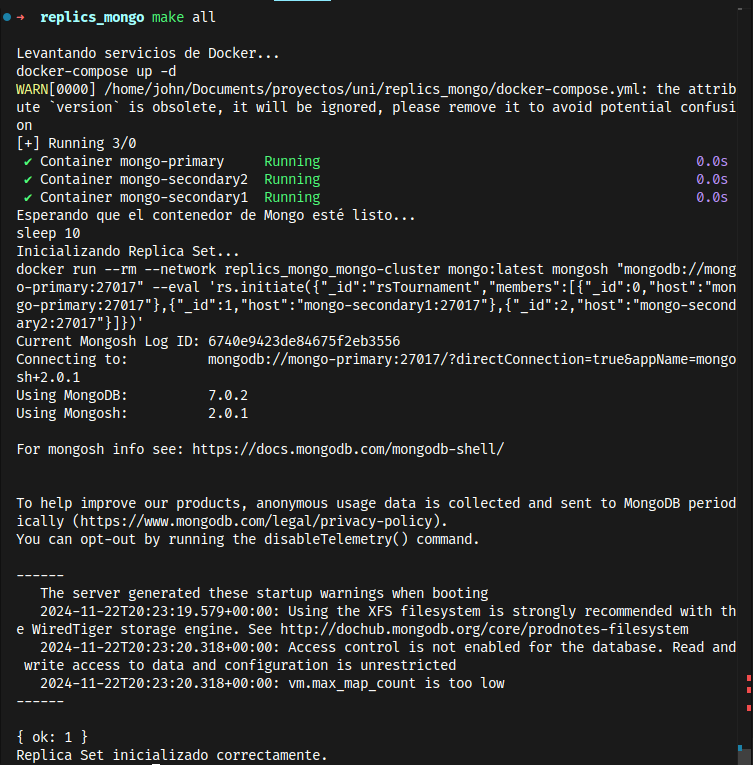

replicacion de nosql

levantar las replicas

```bash
make all
```

despues de ejecutar este comando se levantarian las replicas ya que todo esta automatizado para el uso


verificar el status de las replicas

```bash
make check-status
```

al iniciar los contendores se tendra una respuesta como esta

